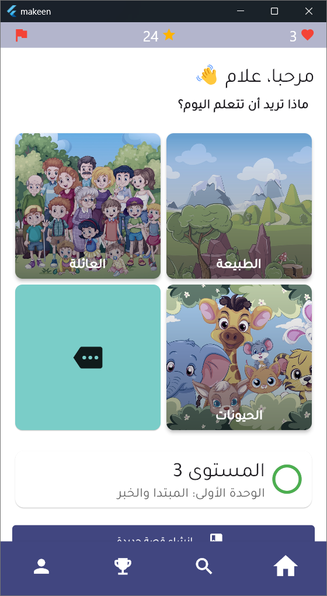
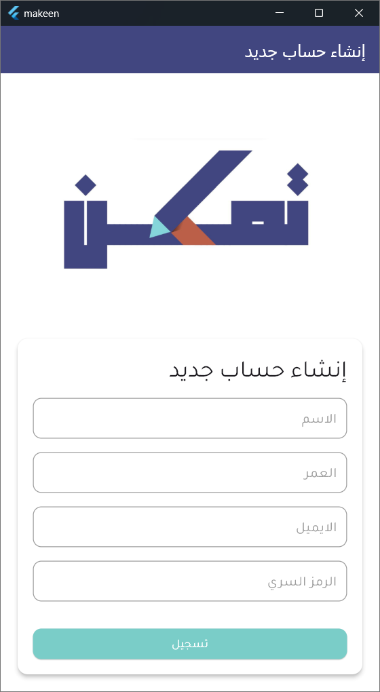
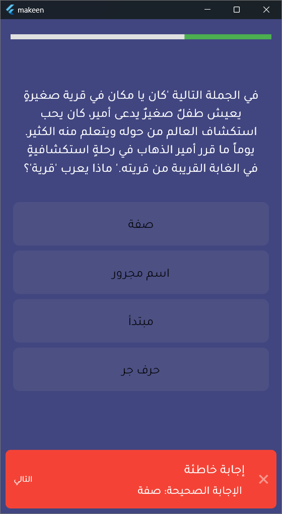
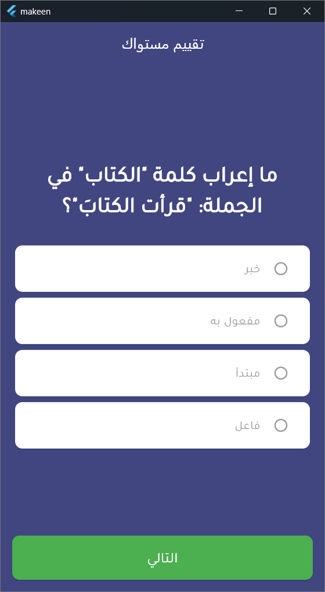
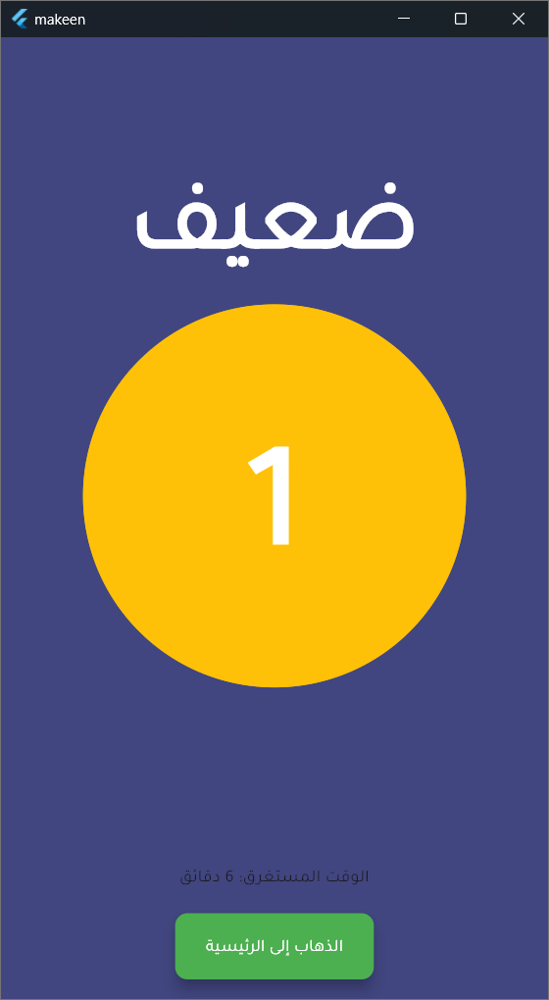
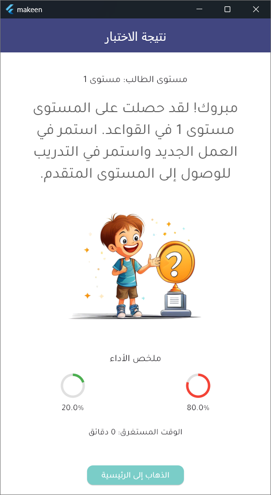

# Tmkeen

**Tamakn** is a Flutter application designed to teach the kids grammer in ARabic using the best LLM model **ALLAM model**.

## Screenshots

|  |  |  |
| ------------------------------------ | --------------------------------------- | ------------------------------------ |
|  |  |  |


## Getting Started

### Prerequisites

Before running the Tmkeen app, make sure you have the following installed:

- **Flutter SDK**: [Download Flutter](https://flutter.dev/docs/get-started/install) and follow the installation guide for your operating system.
- **Dart SDK**: Included with Flutter.
- **Android Studio or Xcode** (for Android and iOS builds, respectively)
- **VS Code or Android Studio** (recommended for Flutter development)

### Installation

1. **Clone the repository:**

   ```bash
   git clone <repository-url>
   cd tmkeen
2. **Install dependencies:**

```bash
flutter pub get
```

3. **Configure your environment:**

- Ensure that either a simulator/emulator is running or a physical device is connected.
- Run flutter doctor to check for any issues with your environment setup. Resolve any issues before proceeding.

### Running the App
To run the app on an emulator or connected device:
> Note: We run the app on windows, but it can work on any platform. 

```bash
flutter run
```
### Building for Production
For Android:
```bash
flutter build apk --release
```
For iOS:

```bash
flutter build ios --release
```
> Note: For iOS, a Mac with Xcode installed is required.


### Folder Structure
- lib/: Main source code directory
- assets/: App assets like images and fonts
- test/: Test files for unit and widget tests
